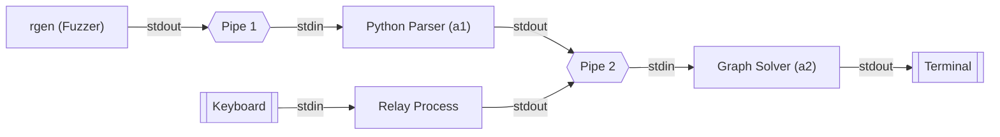
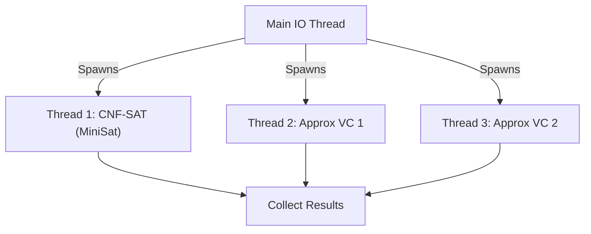

# Vertex Cover Solver

A high-performance, multithreaded system for solving the Minimum Vertex Cover problem. This project integrates a **C++** computational engine with a **Python** command parser via **IPC**, utilizing **MiniSat** for optimal solutions and approximation algorithms.


## Overview

This project was developed for **ECE 650: Methods and Tools for Software Engineering**. It demonstrates two distinct architectural patterns for solving complex graph problems:

1.  **Core Engine (A1-A2):** Built a robust **Python** command parser and a **C++** graph algorithm engine to handle dynamic inputs and Shortest Path calculations.
2.  **Multiprocess Architecture (A3):** Developed a randomized test input generator in C++ to act as a **fuzzer**, integrated with the core engine into a **pipeline** using **IPC** and Linux signals to test system stability.
3.  **Singlethreaded Solver (A4):** Optimized the NP-complete Vertex Cover problem via polynomial-time reduction to **CNF-SAT** and MiniSat integration.
4.  **Multithreaded Solver Optimization (Project):** Re-engineered the system into a high-performance, **multithreaded** solver to tackle the problem using three concurrent threads with different algorithms: Optimal vs. Approximation.

## Architecture 1: Multiprocess Pipeline (Assignment 3)

The driver program (`ece650-a3`) uses `fork`, `exec`, and `pipe` to chain independent components into a processing pipeline.



- **Process Lifecycle:** Orchestrates the concurrent execution of 4 processes using `fork/exec`, implementing a robust monitoring loop with `waitpid` and `SIGTERM` to ensure the graceful shutdown of the entire pipeline if any component fails.
- **I/O Multiplexing:** Implements a "Fan-In" architecture where asynchronous inputs from the Fuzzer (`rgen`) and User (`stdin`) are merged into a single data stream for the Solver (`a2`) using shared Linux pipes.

## Architecture 2: Multithreaded Solver (Final Project)

The final project (`ece650-prj`) is a monolithic, optimized C++ application that uses **multithreading** to compare algorithmic efficiency in real-time.



- **Main Thread:** Handles I/O parsing and state management.
- **Worker Threads:** 3 concurrent threads execute different algorithms on the same graph data.
- **Synchronization:** Ensures thread-safe data collection and timeout handling for the NP-complete CNF-SAT solver.

## Key Features

### 1. High-Performance Algorithms

- **Optimal Solution (CNF-SAT):** Implements a polynomial-time reduction from Vertex Cover to CNF-SAT, utilizing the **MiniSat** library to find the exact minimum cover.
- **Approx-VC-1:** Approximation algorithm based on highest-degree vertex selection.
- **Approx-VC-2:** Approximation algorithm based on edge selection.

### 2. Verification & Testing

- **Regression Test Harness:** A custom Bash script (`run.sh`) that automates the build process (CMake) and executes 12 regression test cases via I/O redirection.
- **Fuzz Testing:** The `rgen` tool acts as a fuzzer, generating random graph specifications to stress-test the pipeline.

## Build Instructions

The project uses **CMake** for build automation.

### Prerequisites

- C++ Compiler (GCC/Clang)
- Python 3
- CMake

### Compilation

```bash
# Build the project and execute regression tests
bash run.sh <option_code>
```

**Option Code**:

- `0`: cmake build with default configuration
- `1`: cmake build with clang++ compilation
- `2`: enable address sanitizer

*Note: The script automatically handles CMake configuration, MiniSat linking, and compilation.*

## Usage

### Running the Multiprocess Pipeline

The driver program `ece650-a3` connects the random generator (`rgen`), Python parser (`a1`), and graph solver (`a2`) into a single pipeline. It accepts command-line arguments to control the fuzzing parameters.

**Usage:**

```bash
./build/ece650-a3 [options]
```

**Options:**

- `-s <int>`: Maximum number of streets (default: 10)
- `-n <int>`: Maximum number of line segments per street (default: 5)
- `-l <int>`: Maximum wait time (seconds) between generations (default: 5)
- `-c <int>`: Coordinate range [-k, k] (default: 20)

**Example:**

```bash
# Run with up to 5 streets, wait up to 4 seconds, coordinate range [-15, 15]
./build/ece650-a3 -s 5 -l 4 -c 15
```

**Output:** The program will continuously output the generated graph (`V`, `E`), followed by the shortest path result (using the `s` command), as the random generator feeds inputs into the pipeline.

### Running the Multithreaded Solver

The main executable reads graph commands from `stdin`.

**Example:**

```bash
./build/ece650-prj
V 5
E {<1,5>, <5,2>, <1,4>, <4,5>, <4,3>, <2,4>}
```

**Output:**

```
CNF-SAT-VC: 1,2,4,5
APPROX-VC-1: 1,4,5,2
APPROX-VC-2: 1,5,2,4
```

## Performance Analysis

A rigorous performance analysis was conducted to compare the optimal CNF-SAT approach with the approximations.

- **Methodology:** Utilized `pthread_getcpuclockid` to benchmark execution speed across graph sizes.
- **Result:** Analyzed runtime deviations and approximation ratios to validate algorithmic efficiency.

